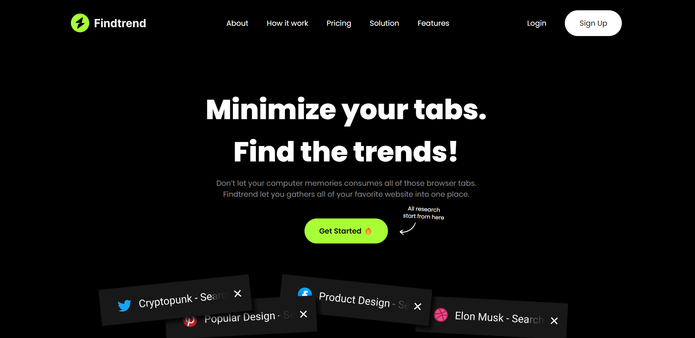

# Find Trend Landing Page

### Screenshot

### Links

- Live Site URL: [https://main--nimble-salmiakki-9c031f.netlify.app/](https://main--nimble-salmiakki-9c031f.netlify.app/)
- Figma: [Designed by Odama Studio](https://www.figma.com/file/WJFmySkWyK0ZewopoFUJFo/Findtrend-Webflow-(Free-Code)-(Community)?type=design&node-id=2-620&mode=design&t=xclBfDSDETErabsP-0)

### Built with

    
    
      

## Author

  
  

